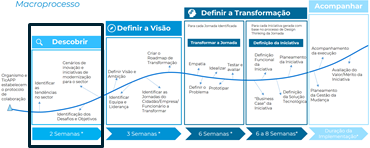
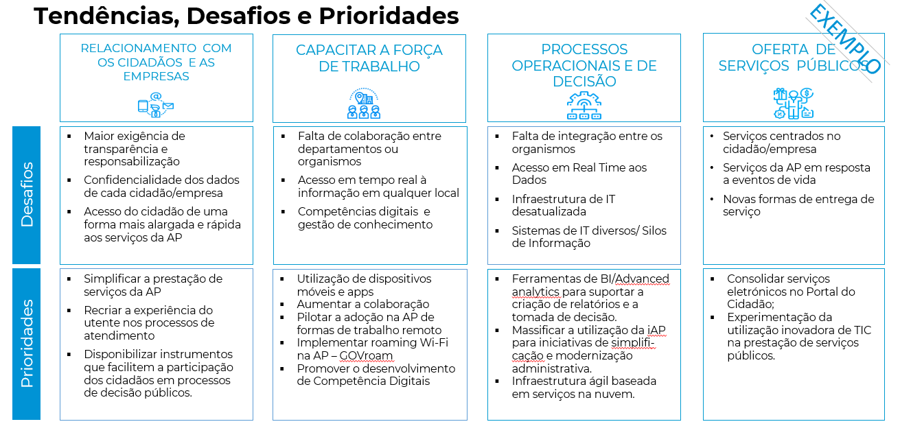
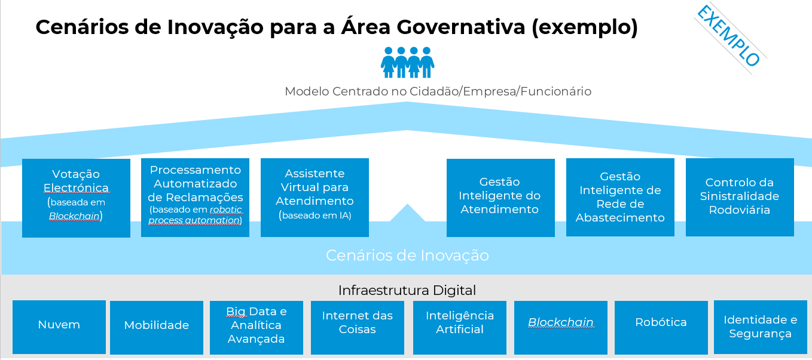

# 0. Descobrir

## Descrição

A identificação de desafios, de tendências, de cenários de inovação e das iniciativas de modernização em curso e propostas pelo organismo (por exemplo candidaturas SAMA2020), permitirá criar uma base de conhecimento sobre a área governativa da AP na qual o organismo cumpre a sua missão. 

## Atividades
* Workshop para a identificação dos desafios, iniciativas e prioridades do organismo e do sector da AP
* Research de cenários de inovação no sector
* Workshop de apresentação dos resultados e de definição das áreas de foco 

## Resultados Esperados
* Sistematizar os desafios, iniciativas e prioridades do organismo/sector do governo.
* Fazer o Benchmarking com organismos similares noutros países
* Identificar cenários em que a plataforma digital pode aumentar a eficiência e eficácia dos serviços prestados aos cidadãos e às empresas

## Intervenientes
#### Entidade Pública
* Dirigentes de topo

#### Equipa de Transformação
* Gestor de Projeto 
* Especialista em Transformação Digital
* Especialista UX 

## Exemplos

