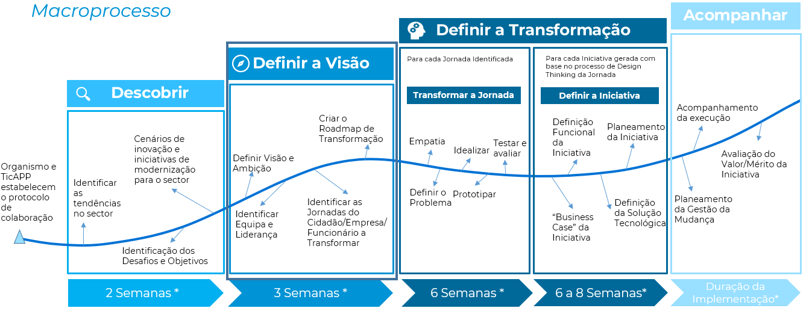
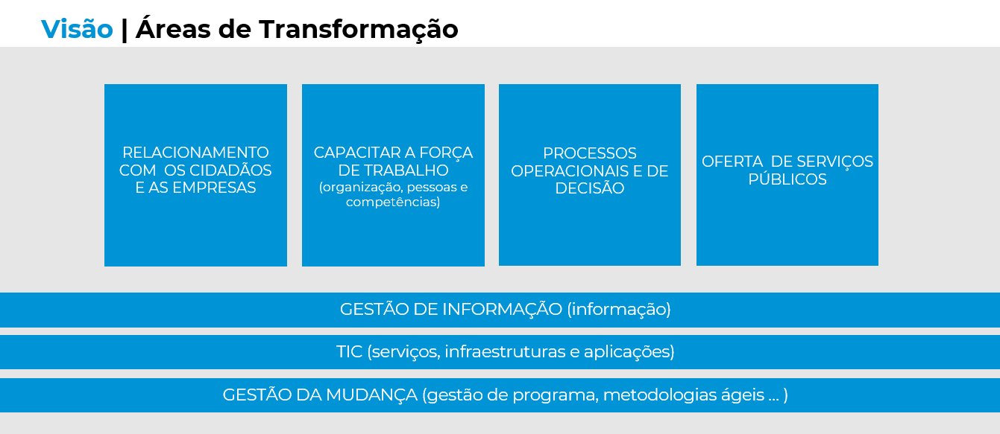
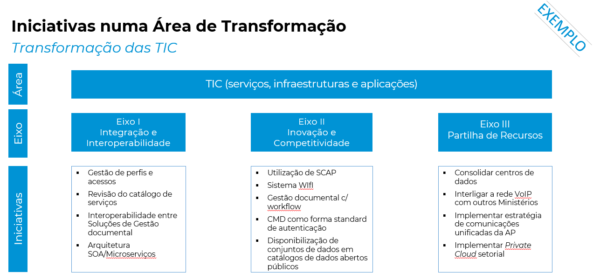

# 1. Definição da Visão de Transformação Digital

## Descrição

A visão de transformação digital deverá traduzir-se na aspiração e compromisso do organismo com um Programa de Transformação Digital, que deverá consistir de soluções de curto prazo e de um plano de estratégia digital a longo prazo. Nesta definição têm intervenção direta os membros do conselho diretivo e outros decisores de áreas funcionais dentro dos organismos e deverá potenciar os processos de design thinking.

## Atividades
* Workshops para a identificação da visão e das áreas de foco da transformação
* Sessão de Trabalho com direção do organismo para identificar equipa e liderança.
* Workshops para Identificar as Jornadas do Cidadão/Empresa/Funcionário a Transformar
* Definir o Programa de Transformação

## Resultados Esperados
* Criação de uma visão integrada para a transformação digital no organismo
* Definição do Programa  de Transformação Digital 

## Intervenientes
##### Organismo
* Conselho Diretivo
* Diretores de 1ª Linha

##### Equipa de Transformação
* Gestor de Projeto
* Especialista de Transformação Digital
* Especialista UX
* Arquiteto Empresarial
* Arquiteto Solução

## Exemplos
 

