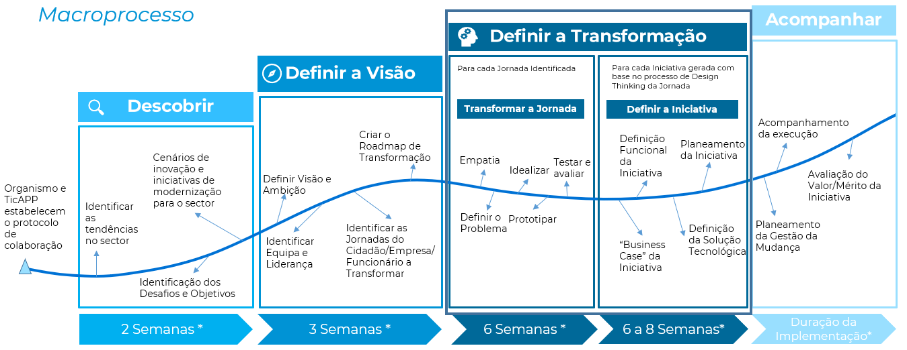

# 2. Definir a Transformação

## Descrição

Após a identificação do Programa de Transformação Digital com a priotitização das jornadas de utilizador que deverão ser transformadas, para cada jornada identidicada deverão realizadas as atividades identificadas em [Transformar a Jornada](2.1-TransformaraJornada.md), que terão como base a metodologia ***Design Thinking***, com base na qual é realizado um trabalho de identificação dos problemas/necessidades e de descoberta de soluções a prototipar e testar, baseando essa descoberta em workshops de ideação. Com base neste trabalho serão identificadas várias iniciativas de melhoria tirando partido das tecnologias emergentes ou por exemplo reengenharia de processos.   
  
Para cada iniciativa devem ser executadas as atividades definidas em [Definir a Iniciativa](2.2-DefinirIniciativa.md), as quais têm como objetivo definir a iniciativa funcionalmente e em termos de arquitetura de sistemas de informação. Estes dois elementos de informação permitirão que as entidades públicas possam realizar a implementação da mesma quer seja através de recursos internos ou da contratação de fornecedores externos.  

