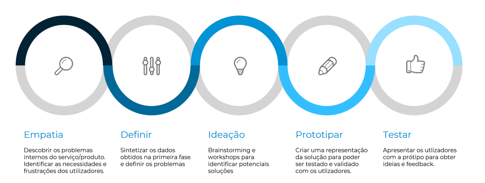


# 2.1 Transformar a Jornada

## Descrição
O passo designado de Transformar a Jornada (do utilizador, do cidadão, da empresa ou do funcionário) irá focar-se na jornada atual da persona, quando esta pretende cumprir um determinado objetivo (“job to be done”).
Neste passo deve ser utilizada a metodologia  **Design Thinking**, com base na qual é realizado um trabalho de identificação dos problemas/necessidades e de descoberta de soluções a prototipar e testar, baseando essa descoberta em workshops de ideação. A prototipagem e os testes sobre os protótipos criados permitirão uma avaliação e validação pelos utilizadores, obtendo o seu feedback num curto espaço de tempo. 

Este passo permite-nos realizar:
* A transformação centrada nos problemas, frustrações ou necessidades do cidadão, empresa ou funcionário.
* A alteração do paradigma de ideação das soluções, de fora da organização para dentro e não o inverso)
* Os testes e validação das soluções identificadas antes de se proceder à contratação dos serviços para a sua implementação.

## Atividades

[Empatia](2.1-TransformaraJornada-Empatia.md)

[Definir](2.1-TransformaraJornada-Definir.md)

[Ideação](2.1-TransformaraJornada-Ideacao.md)

[Prototipar](2.1-TransformaraJornada-Prototipar.md)

[Testar](2.1-TransformaraJornada-Testar.md)

## Entregáveis

## Recursos

