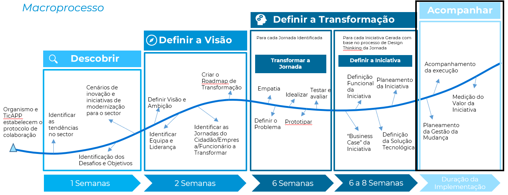

# 3. Transformar a Jornada

## Descrição
Com o objetivo de apoiar as entidades públicas a executar as iniciativas, definidas com a sua intervenção, o TicAPP promove a necessidade de acompanhamento da execução do programa de transformação e das iniciativas que dele constam. Pensamos que se trata de uma boa prática, a qual deve ser seguida nos projetos de transformação da Administração Pública. Esta atividade deve abordar temas como a gestão do plano de execução, a gestão de riscos, a avaliação da adesão à arquitetura de sistemas de informaç~so definida e boas práticas aplicáveis; apresentando recomendações a aplicar que permitam efetivar a transformação pretendida.

## Atividades
* Participação em reuniões de ponto de situação de projeto e comité de steering da execução da iniciativa/programa.
* Revisão das soluções tecnológicas implementadas
* Apoiar na execução do plano da iniciativa.
* Avaliação da adesão às boas práticas

## Resultados Esperados
* Redução dos riscos associados à execução da iniciativa
* Apoiar as entidades públicas na gestão da relação com os fornecedores
* Apoiar as entidades públicas na avaliação dos entregáveis produzidos pelos fornecedores.

## Intervenientes
#### Entidades Pùblicas
* Sponsor do Projeto
* Líder do Projeto

#### Equipa de Transformação
* Gestor de Projeto
* Especialista de Transformação Digital
* Arquiteto Empresarial

## Recursos

