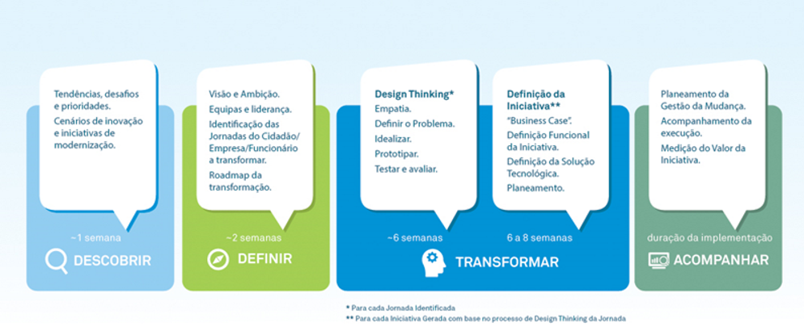

### A razão da criação deste guia?
O nosso objetivo é prestar serviços públicos digitais que sejam simples de usar e acessíveis a qualquer cidadão ou empresa, independentemente da sua condição, localização ou dispositivo utilizado. Queremos que o contato entre os utilizadores e os serviços públicos seja cómodo e conveniente, de forma semelhante ao que de melhor já experimentaram noutras atividades realizadas online. 
Para fazer da tecnologia um instrumento transformador da relação existente com os serviços públicos, é preciso arriscar, desenhar e prototipar novos serviços ou novas formas de os prestar, utilizando sempre que possível os dados disponíveis para antecipar necessidades, melhorar os serviços públicos e reduzir custos administrativos.
Este manual fornece orientações práticas e detalhadas sobre como transformar a Administração Pública Portuguesa para se tornar mais ágil, aberta e focada no utilizador final dos serviços. 

### A quem se destina este guia?
Este manual serve como guia, para as equipas de projeto, na criação de serviços públicos digitais focados nos cidadãos, empresas ou funcionários.

### Por onde começar?
A framework usada neste guia e definida pela equipa do TicAPP para a execução das suas atividades no âmbito da transformação digital da Administração Pública, permite às entidades públicas, que de acordo com a sua maturidade e estágio na jornada de transformação digital, possa tirar partido das orientações, documentos e exemplos práticos aqui apresentados.    

[Descobrir](0-Descobrir.md)    
Quando uma entidade pública não possui uma orientação clara de qual a melhor estratégia de transformação a seguir, poderá começar por realizar as atividades definidas na fase de Descobrir. Nesta fase pretende-se sistematizar os desafios, as iniciativas e as prioridades do entidade/área governativa.  

[Definir a Visão](1-DefinicaoVisao.md)   
Caso a entidade pública tenha uma ideia clara das iniciativas e prioridades para a transformação e, conheça a forma como outros países estão a tirar partido da infraestrutura digital para evoluir as suas atividades, pode evoluir e definir a sua visão de transformação digital, a qual traduz a sua aspiração e compromisso com um Programa de Transformação Digital.
  

[Transformar](2-Transformar.md)   
O Programa de Transformação Digital, desenvolvido na fase anterior, deverá permitir identificar quais as jornadas dos utilizadores (cidadãos, empresas ou funcionários) que devem ser alvo de transformação. 
Para cada jornada identificada deverão realizadas as atividades identificadas em [Transformar a Jornada](2.1-TransformaraJornada.md), que terão como base a metodologia ***Design Thinking***. Com base neste trabalho serão identificadas várias iniciativas de melhoria tirando partido das tecnologias emergentes ou por exemplo reengenharia de processos. Para cada iniciativa devem ser executadas as atividades definidas em [Definir a Iniciativa](2.2-DefinirIniciativa.md), as quais têm como objetivo definir a iniciativa funcionalmente e em termos de arquitetura de sistemas de informação. 

[Acompanhar](3-Acompanhamento.md)  
A execução do Programa de Transformação Digital e, a consequente implementação das iniciativas, deverá ter o acompanhamento da equipa de transformação digital, a qual aborda temas como a gestão do plano de execução, gestão de riscos, avaliação da adesão à arquitetura definida e boas práticas aplicáveis; apresentando recomendações a aplicar que permitam efetivar a transformação pretendida.

